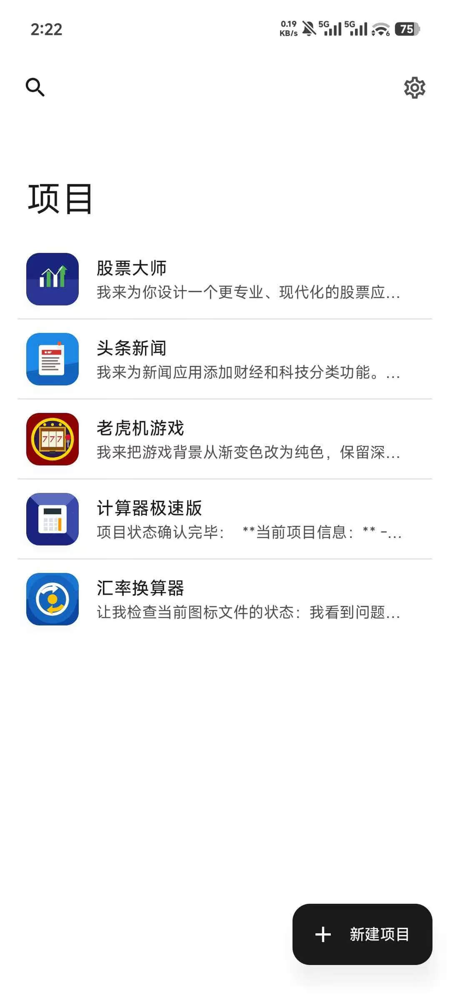
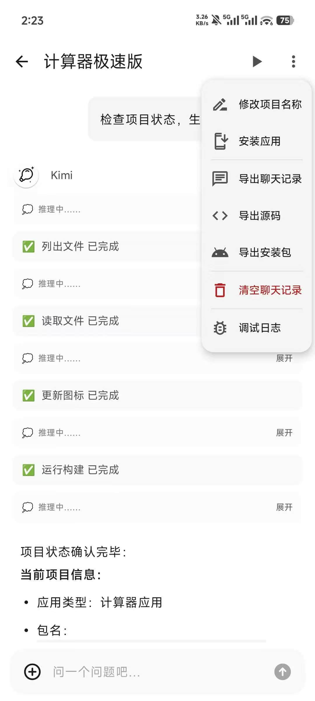
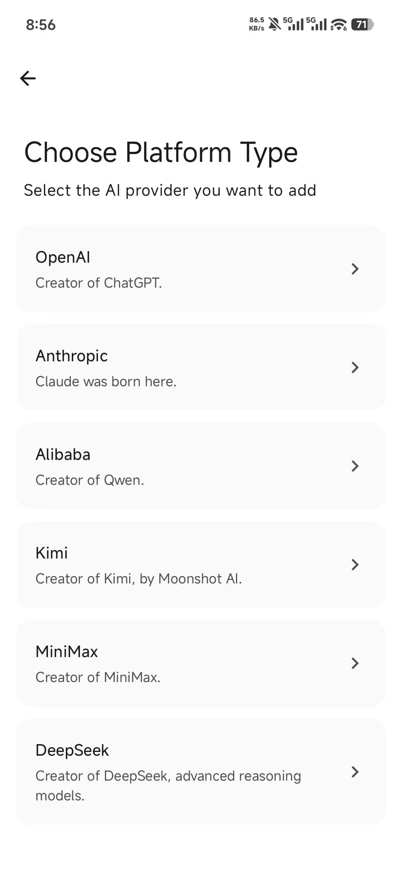
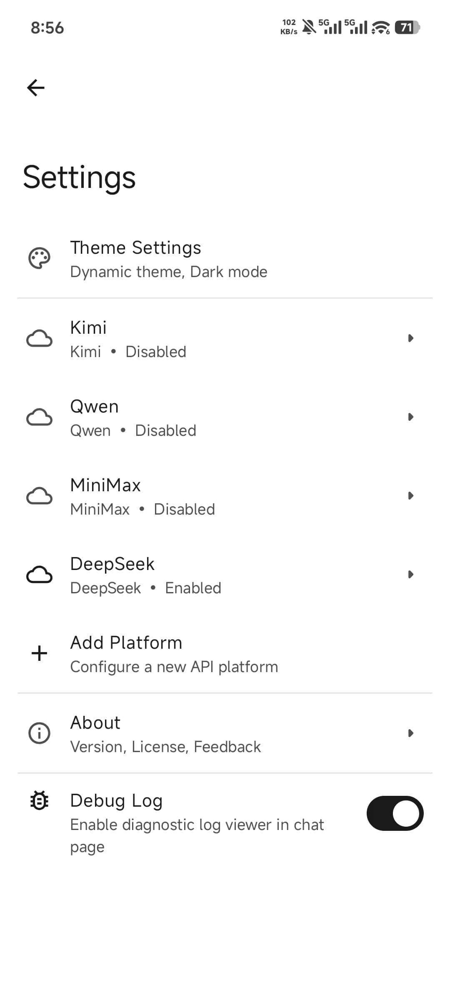

# VibeApp

> Describe it. Build it. Install it. All on your phone.

[](LICENSE)
[](https://android.com)
[]()
[]()

[**中文文档**](README_CN.md)

<p align="center">
  
</p>

---

## What is VibeApp

VibeApp is a **fully open-source** Android app that lets anyone **generate, compile, and install** a real native Android app directly on their phone using natural language — no PC, no coding skills, no cloud required.

The entire build pipeline runs on-device. Your code never leaves your phone.

### Screenshots

| Home | Chat | Add Platform | Settings |
|:----:|:----:|:------------:|:--------:|
|  |  |  |  |

## Why VibeApp

There are many AI app builders out there, but they share a common problem: **the output isn't a real app**.

|      | Other AI Builders     | VibeApp             |
|------|-----------------------|---------------------|
| Output  | Web App / PWA / Cloud-compiled | **Native APK**          |
| Compilation | Cloud-based                | **On-device local build**         |
| Privacy | Code uploaded to servers          | **Code never leaves your phone**       |
| Source Export | Mostly unsupported             | **One-tap source code export**          |
| Barrier | Requires deployment/environment setup         | **Just configure an AI API key** |

We believe that in the AI era, apps won't disappear — instead, more people will **become app creators for the first time**.

---

## Features

### Core Capabilities

- **Conversational Creation** — Describe what you want in natural language, iterate through multi-turn dialogue
- **On-Device Full Build Pipeline** — AAPT2 + JavacTool + D8 + packaging/signing, the complete build chain runs on your phone
- **Automatic Error Fix Loop** — Compilation failures are automatically fed back to AI for repair
- **Multi-Project Management** — Manage multiple app projects simultaneously with version snapshots and build cache
- **Multi-Model Support** — Claude, GPT, Gemini, Qwen, Kimi, MiniMax, Groq, OpenRouter, and OpenAI-compatible local Ollama
- **Flexible Export** — Install APK directly or export complete source code

### Code Generation Strategy (Triple Guarantee)

Stable AI code generation is the product's core. VibeApp uses a triple guarantee mechanism:

1. **Template Constraints** — AI doesn't generate from scratch; it fills in predefined skeletons, minimizing structural errors
2. **Strict System Prompt** — Explicit whitelist of allowed standard SDK classes
3. **Auto-Fix Loop** — On compilation failure, sanitized error logs are fed to AI for automatic repair, covering most common error scenarios

---

## Architecture

```
+--------------------------------------------------------------+
| Presentation Layer                                           |
| Compose Screens + ViewModels                                 |
| chat / home / setup / settings / start                       |
+--------------------------------------------------------------+
| Feature Layer                                                |
| Agent Loop Coordinator + Project Manager + Project Init      |
| Agent Tools (read/write/list files, run build, rename, icon) |
+--------------------------------------------------------------+
| Data Layer                                                   |
| Room + DataStore + Repository + Network API clients          |
| OpenAI / Anthropic / Google / Qwen / Kimi / MiniMax / Groq   |
+--------------------------------------------------------------+
| Build Engine Module (build-engine)                           |
| RESOURCE -> COMPILE -> DEX -> PACKAGE -> SIGN                |
| AAPT2     JavacTool   D8    ApkBuilder   ApkSigner           |
+--------------------------------------------------------------+
| Device Filesystem                                            |
| /files/projects/{projectId}/app + generated source + APK     |
+--------------------------------------------------------------+
```

Main pipeline:

```
ChatScreen
  -> ChatViewModel
  -> AgentLoopCoordinator / ProjectInitializer / ProjectManager
  -> Repository + API Client / Workspace FS
  -> BuildPipeline.run()
  -> signed.apk -> PackageInstaller
```

> For detailed layer descriptions, module responsibilities, and key sequences, see [docs/architecture.md](docs/architecture.md)

---

## How the Build Chain Works

```
User describes what they want
     |
AI generates Java source + XML layouts (constrained by System Prompt)
     |
AAPT2 (compile res/ + link Manifest + generate R.java + generated.apk.res)
  |-- Failure -> Error sanitization -> AI fix -> retry up to 3 times
  +-- Success |
JavacTool compile (source code + R.java -> .class)
     |
D8 conversion (.class -> classes.dex)
     |
APK packaging (generated.apk.res + classes.dex -> generated.apk)
     |
ApkSigner (V1 + V2 signing -> signed.apk)
     |
PackageInstaller guides user to install
```

### Build Chain Tech Stack

| Component | Purpose | Notes |
|-----------|---------|-------|
| **AAPT2** | `res/` + Manifest -> `R.java` + `generated.apk.res` | Completes resource compilation and linking before Java compilation |
| **JavacTool** | Java -> `.class` | Compiles source code and AAPT2-generated `R.java` |
| **D8** | `.class` -> `.dex` | Official Android DEX compiler |
| **ApkBuilder + ApkSigner** | Package + Sign | Produces the final `signed.apk` |

---

## Quick Start

### Requirements

- Android 10.0 (API 29) or above
- An AI API Key (Claude / GPT-4o / Gemini / Qwen / Kimi / MiniMax — pick one) or a local Ollama service

### Install

[Download the latest APK from the Releases page](https://github.com/Skykai521/VibeApp/releases)

### Build from Source

```bash
git clone https://github.com/Skykai521/VibeApp.git
cd VibeApp
./gradlew assembleDebug
```

### First Use

1. Open VibeApp -> Settings -> Configure your AI API Key
2. Tap "New Project"
3. Describe the app you want in natural language
4. Wait for auto-generation -> compilation -> installation

---

## Project Structure

```
VibeApp/
+-- app/                                 # Android app module
|   +-- src/main/kotlin/com/vibe/app/
|   |   +-- presentation/                # Compose UI, navigation, ViewModel, theme
|   |   |   +-- common/
|   |   |   +-- theme/
|   |   |   +-- ui/
|   |   |       +-- chat/
|   |   |       +-- home/
|   |   |       +-- main/
|   |   |       +-- setting/
|   |   |       +-- setup/
|   |   |       +-- diagnostic/
|   |   +-- feature/                     # Core business orchestration
|   |   |   +-- agent/                   # Agent loop, gateway, tool registry
|   |   |   |   +-- loop/
|   |   |   |   +-- tool/
|   |   |   |   +-- service/
|   |   |   +-- diagnostic/              # Chat diagnostic logger
|   |   |   +-- project/                 # ProjectManager / Workspace abstraction
|   |   |   +-- projecticon/             # Launcher icon generation
|   |   |   +-- projectinit/             # Template project init, build entry
|   |   +-- plugin/                      # Plugin runtime host
|   |   |   +-- PluginContainerActivity  # Proxy Activity (5 process-isolated slots)
|   |   |   +-- PluginManager            # Slot allocation, LRU eviction
|   |   |   +-- PluginResourceLoader     # DexClassLoader + AssetManager resource loading
|   |   +-- data/                        # Persistence, network, DTO, repository
|   |   |   +-- database/
|   |   |   |   +-- dao/
|   |   |   |   +-- entity/
|   |   |   +-- datastore/
|   |   |   +-- dto/
|   |   |   +-- model/
|   |   |   +-- network/
|   |   |   +-- repository/
|   |   +-- di/                          # Hilt modules
|   |   +-- util/                        # Common utilities and extensions
|   +-- src/main/res/                    # UI resources, multi-language strings
|   +-- src/main/assets/                 # android.jar, templates, static assets
|   +-- schemas/                         # Room schema snapshots
+-- build-engine/                        # On-device build engine
|   +-- src/main/java/com/vibe/build/engine/
|       +-- apk/                         # APK packaging
|       +-- compiler/                    # JavacCompiler / ECJ compatibility shim
|       +-- dex/                         # D8 dex conversion
|       +-- internal/                    # Workspace, logger, binary resolver
|       +-- model/                       # BuildResult / BuildStage / CompileInput
|       +-- pipeline/                    # BuildPipeline / DefaultBuildPipeline
|       +-- resource/                    # AAPT2 resource compilation and linking
|       +-- sign/                        # Debug signing
+-- shadow-runtime/                      # Plugin runtime classes (ShadowActivity etc.)
+-- build-tools/                         # Bundled build toolchain dependencies
|   +-- android-stubs/
|   +-- common/
|   +-- javac/
|   +-- jaxp/
|   +-- kotlinc/
|   +-- logging/
|   +-- manifmerger/
|   +-- project/
+-- docs/                                # Documentation
|   +-- architecture.md                  # Full architecture guide
|   +-- assets/
+-- .github/                             # Issue templates / CI
+-- CONTRIBUTING.md                      # Contribution guide and branch strategy
+-- LICENSE
+-- README.md                            # English README (this file)
+-- README_CN.md                         # Chinese README
```

---

## Roadmap

### Phase 1 — MVP: End-to-End Pipeline

> Goal: User types a sentence -> gets an installable APK

- [x] Integrate Claude / OpenAI / Qwen APIs for code generation
- [x] Integrate build modules (JavacTool + D8 + AAPT2)
- [x] Single Activity + View-based app generation
- [x] Automatic error fix loop
- [x] APK signing + PackageInstaller guided installation
- [x] App icon generation support
- [x] Basic UI: chat interface + build progress

### Phase 2 — Experience Refinement

> Goal: Make the generation process visible, controllable, and iterable

- [x] Multi-project management + version snapshots
- [x] Multi-model switching (Claude / GPT / Gemini / Qwen / Kimi / MiniMax / Groq / OpenRouter / Ollama)
- [x] Plugin system — run generated apps inside VibeApp without installation (Shadow-based, 5 process-isolated slots)
- [x] Build cache — pre-dex caching for library JARs, significantly faster subsequent builds
- [x] AI multimodal support — image input across Anthropic, OpenAI, and Kimi providers
- [x] Context compaction — multi-strategy conversation compaction to support longer multi-turn sessions
- [x] Diagnostic logging — structured event tracking for the agent loop, viewable in-app

### Phase 3 — Quality & Capability

> Goal: Generate higher-quality utility apps and lightweight data tools that anyone can use

- [ ] Richer UI component templates — more built-in patterns for common utility app layouts
- [ ] Smarter auto-fix — broader error coverage and higher first-attempt success rate
- [ ] Utility app enhancements — network requests, local storage, scheduled tasks, and other common capabilities
- [ ] Web scraping & data tools — structured data fetching and display powered by jsoup
- [ ] Continuous iteration — keep refining a generated app through multi-turn conversation
- [ ] Community template marketplace — share and reuse high-quality tool templates

---

## Acknowledgments

VibeApp stands on the shoulders of these excellent open-source projects:

| Project | Contribution |
|---------|-------------|
| [gpt_mobile](https://github.com/Taewan-P/gpt_mobile) | AI Chat UI reference |
| [CodeAssist](https://github.com/tyron12233/CodeAssist/) | On-device full Android IDE, proving the end-to-end feasibility |
| [Shadow](https://github.com/Tencent/Shadow) | Tencent's plugin framework — inspired the host-delegation pattern for running generated apps inside VibeApp without installation |

---

## Contributing

We welcome contributions of any kind! Please read [CONTRIBUTING.md](CONTRIBUTING.md) for details.

**Ways to contribute:**

- Bug reports and feature suggestions
- Improve AI code generation prompt templates
- Extend supported app types and UI components
- Improve build chain stability and speed
- Improve documentation and examples

---

## License

This project is licensed under the [GPL-3.0 License](LICENSE).

---

## About the Name

**VibeApp** — the Chinese name is **Yi Zao** (意造).

"Vibe" comes from Vibe Coding — using natural language to drive AI to write code.
"Yi Zao" means "creating with intention" — two characters conveying idea (意) and creation (造).

> The moment an ordinary person feels "I built a real app" — that's the entire reason VibeApp exists.

---

<p align="center">
  Made with love for everyone who ever had an app idea but didn't know how to build it.
</p>
