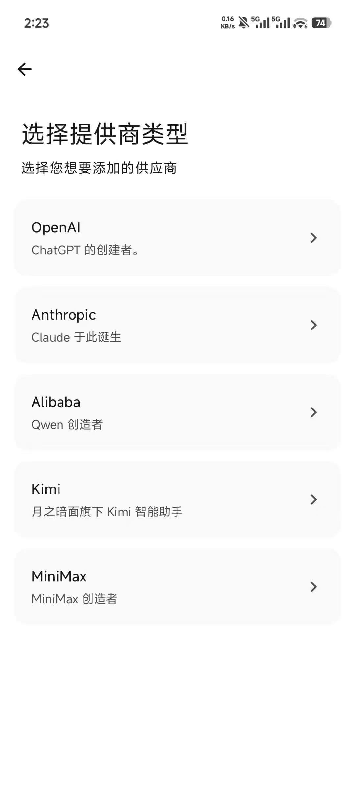
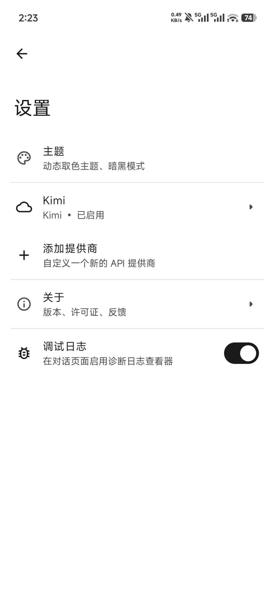

# VibeApp（意造）

> 用一句话，造一款真正属于你的 Android App。
> *Describe it. Build it. Install it. All on your phone.*

[](LICENSE)
[](https://android.com)
[]()
[]()
[]()

[**English**](README.md) | 中文

<p align="center">
  
</p>

---

## ✨ 是什么 | What is VibeApp

VibeApp 是一个**完全开源**的 Android 应用，它让任何人都可以通过自然语言描述，**在手机上直接生成、编译、安装**一款真正的原生 Android App——无需电脑，无需编程基础，无需关注代码实现。

你只需要告诉它你想要什么，它就帮你造出来。

**VibeApp** is a fully open-source Android app that allows anyone to generate, compile, and install a native Android app directly on their phone using natural language — no PC, no coding skills, no cloud required.

**v2.0 重点更新：** 生成的应用全面升级为 **Kotlin + Jetpack Compose**，设备端使用真正的 **Gradle 9.3.1 + AGP 9.1.0 + Kotlin 2.0.21** 工具链构建，整套工具链直接打包在 APK 内，**无需任何网络下载**。

### 截图 | Screenshots

|                                  主页                                  |                                     对话                                      |                                      添加平台                                      |                                   设置                                    |
|:--------------------------------------------------------------------:|:---------------------------------------------------------------------------:|:------------------------------------------------------------------------------:|:-----------------------------------------------------------------------:|
|  |  |  |  |

## 🤔 为什么做这件事 | Why

市面上已经有很多 AI App Builder，但它们有一个共同的问题：**生成的不是真正的 App**。

|      | 其他 AI Builder     | VibeApp             |
|------|-------------------|---------------------|
| 输出物  | Web App / PWA / 需要云编译 | **原生 Android APK（Kotlin + Compose）** |
| 编译方式 | 云端                | **设备端本地编译（Gradle + AGP）** |
| 数据隐私 | 代码上传到服务器          | **代码不离开你的手机**       |
| 源码导出 | 大多不支持             | **一键导出源码**          |
| 技术门槛 | 需要部署/配置环境         | **仅需配置 AI API key** |

我们相信，AI 时代不会消灭 App，而是会让更多人**第一次成为 App 的创造者**。

---

## 🚀 功能特性 | Features

### 核心能力

- **💬 对话式创作** — 用自然语言描述需求，多轮对话持续迭代
- **📱 设备端 Gradle + AGP** — 完整 Android 构建栈（Gradle 9.3.1、AGP 9.1.0、Kotlin 2.0.21）全部跑在手机上，零云端依赖
- **📦 内置工具链** — JDK 17、Gradle、Android SDK 36、AAPT2 全部打包进 APK，首次构建无需任何网络下载
- **⚡ 进程内运行** — 通过腾讯 Shadow 插件化框架，生成的应用可直接在 VibeApp 内启动，免装免重启
- **📲 独立安装** — 一键构建非 Shadow flavor APK 并调起系统安装器，像普通应用一样分发
- **🔁 自动错误修复** — 编译失败的结构化诊断自动回喂给 AI 重试
- **📂 多项目管理** — 同时管理多个项目，带自动快照和独立工作区
- **🧠 多模型支持** — Claude、GPT、Gemini、Qwen、Kimi、MiniMax、Groq、OpenRouter，以及 OpenAI 兼容的本地 Ollama
- **📤 灵活导出** — 进程内运行、独立安装、一键导出完整源码

### 代码生成策略

AI 生成代码的稳定性是产品的核心，VibeApp 采用三层保障：

1. **Kotlin + Compose 模板** — AI 不从零生成，而是在预配好 Shadow 兼容的 `ShadowComposeActivity` 骨架上填空，最大限度降低结构性错误
2. **严格 System Prompt** — 明确 Compose-only 约束，列出 `ComponentActivity` / `setContent` / native 库等禁用项
3. **自动修复循环** — 编译失败时 AGP 的结构化诊断回喂给 AI 修复，覆盖绝大多数常见 Compose / Kotlin 错误

---

## 🏗️ 架构设计 | Architecture

```
┌──────────────────────────────────────────────────────────────┐
│ Presentation Layer                                           │
│ Compose 界面 + ViewModel + 导航                                 │
│ chat / home / setup / settings / start / diagnostic          │
├──────────────────────────────────────────────────────────────┤
│ Feature Layer                                                │
│ Agent Loop Coordinator（gateway 无关的工具调度）                    │
│ Project Manager + Workspace + Snapshot                       │
│ Agent Tools — v2 构建工具、文件操作、图标、UI 检视                       │
├──────────────────────────────────────────────────────────────┤
│ Data Layer                                                   │
│ Room + DataStore + Repository + Network API 客户端             │
│ OpenAI / Anthropic / Google / Qwen / Kimi / MiniMax / Groq   │
├──────────────────────────────────────────────────────────────┤
│ 设备端构建栈                                                      │
│   build-gradle ：GradleProjectInitializer、模板渲染               │
│                  GradleBuildService（Tooling API 客户端）        │
│   gradle-host  ：跑 Gradle Tooling API 的独立 JVM                │
│   build-runtime：内置 JDK + Gradle + AndroidSDK 解压器             │
├──────────────────────────────────────────────────────────────┤
│ 插件运行时（腾讯 Shadow — vendored）                                 │
│ ShadowPluginHost -> :shadow_plugin 进程                        │
│ VibeAppPluginLoader + VibeAppComponentManager                │
│ PluginContainerActivity + Inspector Service                  │
├──────────────────────────────────────────────────────────────┤
│ 设备文件系统                                                      │
│ /files/projects/{projectId}/         — Gradle 多模块工程          │
│ /files/usr/opt/{jdk,gradle,android-sdk}/ — 内置工具链             │
│ /files/shadow/{loader.apk,runtime.apk,plugin-repo}/          │
└──────────────────────────────────────────────────────────────┘
```

当前主链路：

```
ChatScreen
  → ChatViewModel
  → AgentLoopCoordinator → Agent Tool（例如 assemble_debug_v2）
  → GradleBuildService → gradle-host JVM → Gradle Tooling API
  → :app:assemblePluginDebug → app-plugin-debug.apk
  → ShadowPluginHost.launchPlugin → :shadow_plugin
```

> 完整分层说明、模块职责和核心时序见 [docs/architecture.md](docs/architecture.md)

---

## 🔧 编译链工作原理 | How the Build Chain Works

```
用户描述需求
     ↓
AI 在生成好的 Kotlin + Compose 工程里编辑文件
  （create_compose_project / read_project_file / write_project_file /
    edit_project_file 等工具，作用域锁定在本会话的项目工作区）
     ↓
assemble_debug_v2  →  :app:assemblePluginDebug
  （设备端 Gradle 驱动 AGP 9，依赖内置 Android SDK）
  ├─ 失败 → 结构化诊断 → AI 修复 → 重试
  └─ 成功 ↓
app-plugin-debug.apk   （已做 Shadow 字节码改写，只能在 VibeApp 内运行）
     ↓
两条输出路径：
  [A] run_in_process_v2    → Shadow 把 APK 加载进 :shadow_plugin
                             （快速迭代，无需安装）
  [B] install_apk_v2       → 顺带跑 :app:assembleNormalDebug
                             → app-normal-debug.apk
                             → 系统安装器
                             （桌面独立应用）
```

### 编译链技术栈

| 组件 | 作用 | 说明 |
|------|------|------|
| **Gradle 9.3.1** | 构建编排 | 通过 Gradle Tooling API 在设备端运行，由 `:gradle-host` 驱动 |
| **AGP 9.1.0** | Android Gradle Plugin | 完整的 AAPT2 / Kotlin 编译 / D8 / 打包 / 签名链路 |
| **Kotlin 2.0.21** | 源码语言 + Compose 编译器 | Kotlin daemon 跑在设备上的 Gradle 进程里 |
| **腾讯 Shadow 2.x** | 进程内插件运行时 | 字节码改写让插件 Activity 继承自 `ShadowActivity` |
| **内置 JDK 17** | Gradle 运行时 | 自带 arm64-v8a，首次构建时解压到 `filesDir` |
| **内置 Android SDK 36** | `android.jar`、`build-tools/aapt2` | 自带 arm64-v8a，与 JDK 一起解压 |

---

## 📱 快速开始 | Quick Start

### 环境要求

- Android 10.0 (API 29) 及以上，**arm64-v8a**
- AI API Key（Claude / GPT-4o / Gemini / Qwen / Kimi / MiniMax 任选其一）或本地 Ollama 服务
- 大约 2 GB 可用空间（内置工具链 + 每个项目的 Gradle 缓存）

### 安装
[从 Release 页面下载最新 APK](https://github.com/Skykai521/VibeApp/releases)

### 源码构建
```bash
git clone https://github.com/Skykai521/VibeApp.git
cd VibeApp
# 生成内置工具链 tarball（一次性，需要宿主机的 JDK + AGP）：
#   scripts/bootstrap/build-jdk.sh        --abi arm64-v8a
#   scripts/bootstrap/build-gradle.sh
#   scripts/bootstrap/build-androidsdk.sh --abi arm64-v8a
#   scripts/bootstrap/build-manifest.sh
# 再构建应用 APK：
./gradlew assembleDebug
```

### 首次使用

1. 打开 VibeApp → 设置 → 配置你的 AI API Key
2. 主页点击「+」 → 自动生成一个 Kotlin + Compose 项目
3. 用自然语言描述你想要的 App
4. Agent 自动编辑文件、跑 `assemble_debug_v2`、再通过 `run_in_process_v2` 启动
5. 顶栏的 **Run 按钮** 可以不花对话轮次直接重新运行；三点菜单里的 **「安装应用」** 可以把应用独立装到手机上

---

## 📁 项目结构 | Project Structure

```
VibeApp/
├── app/                                   # Android 宿主应用
│   ├── src/main/kotlin/com/vibe/app/
│   │   ├── presentation/                  # Compose UI、导航、ViewModel、主题
│   │   │   └── ui/{chat, home, main, setup, setting, startscreen, diagnostic, ...}
│   │   ├── feature/
│   │   │   ├── agent/{loop, tool, service} # Agent loop + tool registry
│   │   │   ├── project/                   # ProjectManager、Workspace、snapshots
│   │   │   ├── projecticon/               # 启动图标生成（Lucide）
│   │   │   └── diagnostic/                # ChatDiagnosticLogger
│   │   ├── plugin/v2/                     # 腾讯 Shadow 宿主集成
│   │   │   ├── ShadowPluginHost           # 顶层启动编排
│   │   │   ├── ShadowPluginManager        # 具体 manager 子类
│   │   │   ├── ShadowPluginProcessService # :shadow_plugin 进程入口
│   │   │   └── ShadowPluginInspectorService、ShadowActivityTracker 等
│   │   ├── data/                          # Room、DataStore、网络、仓库
│   │   ├── di/                            # Hilt modules
│   │   └── util/
│   ├── src/main/res/                      # UI 资源 + 多语言文案
│   └── src/main/assets/
│       ├── bootstrap/                     # 内置工具链 tarball
│       │   ├── jdk-17.0.13-arm64-v8a.tar.gz
│       │   ├── gradle-9.3.1-common.tar.gz
│       │   ├── android-sdk-36.0.0-arm64-v8a.tar.gz
│       │   └── manifest.json
│       ├── shadow/
│       │   ├── loader.apk                 # 运行时加载到 :shadow_plugin
│       │   ├── runtime.apk
│       │   └── plugin-repo.zip            # Shadow Gradle 插件本地 Maven 仓库
│       ├── agent-system-prompt.md         # v2 agent prompt（Kotlin + Compose + Shadow）
│       └── vibeapp-gradle-host.jar        # gradle-host 模块打进来
├── build-gradle/                          # 宿主发起 Gradle 编排
│   ├── GradleProjectInitializer           # 模板 → 工作区
│   ├── GradleBuildService                 # Tooling API 客户端封装
│   ├── ApkInstaller + StandaloneApkBuilder
│   └── src/main/assets/templates/KotlinComposeApp/   # Compose 工程模板
├── build-runtime/                         # 设备端工具链 bootstrap
│   ├── BootstrapFileSystem、RuntimeBootstrapper、ZstdExtractor
│   └── （把 bootstrap/*.tarball 解压到 filesDir/usr/opt/）
├── gradle-host/                           # 跑 Gradle Tooling API 的独立 JVM
├── third_party/shadow/                    # vendored 腾讯 Shadow
│   ├── upstream/                          # Shadow SDK 源码（core/ + dynamic/）
│   ├── loader-apk/                        # 我们的 CoreLoaderFactoryImpl + VibeApp 胶水
│   └── runtime-apk/                       # Shadow runtime APK 包装
├── scripts/bootstrap/                     # 生成内置工具链 tarball 的脚本
├── docs/                                  # 架构 + 方案 + 规格文档
├── .github/                               # Issue template / CI
├── CONTRIBUTING.md
├── LICENSE
└── README.md / README_CN.md
```

> v1 的 Java/XML 构建栈（`build-engine/`、`build-tools/*`、`shadow-runtime/` 占位、Material Components XML 模板库）已在 2.0 清理中全部删除，仅保留 Kotlin + Compose。

---

## 🗺️ 开发路线图 | Roadmap

### Phase 1 — MVP ✨ 跑通全链路

> 目标：用户输入一句话 → 得到一个可安装的 APK

- [x] 接入 Claude / OpenAI / Qwen API，实现基础代码生成
- [x] 集成编译模块（JavacTool + D8 + AAPT2）
- [x] 实现单 Activity + View 体系的应用生成
- [x] 自动修复循环
- [x] APK 签名 + PackageInstaller 引导安装
- [x] 支持生成应用图标
- [x] 基础 UI：对话界面 + 编译进度

### Phase 2 — 体验优化 🎨

> 目标：让生成过程可见、可控、可迭代

- [x] 多项目管理
- [x] 多模型切换支持（Claude / GPT / Gemini / Qwen / Kimi / MiniMax / Groq / OpenRouter / Ollama）
- [x] 插件系统 — 生成的应用可直接在 VibeApp 内运行，无需安装
- [x] 编译缓存 — 库 JAR 预 dex 缓存，显著加快后续编译速度
- [x] AI 多模态支持 — Anthropic、OpenAI、Kimi 等平台支持图片输入
- [x] 上下文压缩 — 多策略会话压缩，支持更长的多轮对话
- [x] 诊断日志 — Agent 循环的结构化事件追踪，支持应用内查看

### Phase 3 — 质量与能力提升 🔧

> 目标：生成更高质量的工具类应用和轻量数据工具，让零基础用户也能轻松上手

- [x] 更智能的自动修复 — 覆盖更广的错误场景，提升首次生成成功率
- [x] 持续迭代能力 — 每轮自动快照与撤销、项目记忆在迭代模式下注入到 system prompt、多轮对话持续打磨
- [ ] 工具类应用能力增强 — 网络请求、本地存储、定时任务等常用能力支持
- [ ] 爬虫与数据工具 — 结构化数据抓取与展示
- [ ] 社区模板市场 — 分享和复用优质工具模板

### Phase 4 — v2.0 Kotlin + Compose + 设备端 Gradle 🚀

> 目标：用真正的 Android 构建栈替换手写的 Java/XML 流水线

- [x] 生成的应用全面切换到 Kotlin + Jetpack Compose（不再有 Java / XML View）
- [x] 设备端通过 Tooling API 运行 Gradle 9.3.1 + AGP 9.1.0 + Kotlin 2.0.21
- [x] 工具链（JDK 17、Gradle、Android SDK 36、AAPT2）打包进 assets，首次构建零下载
- [x] 接入腾讯 Shadow — `:shadow_plugin` 进程、字节码改写、自定义 `CoreLoaderFactoryImpl` + `ComponentManager`
- [x] `run_in_process_v2` 与 `install_apk_v2` — 同一份源码，两个 flavor（`plugin` 跑在进程内，`normal` 独立安装）
- [x] 顶栏独立 Run 按钮 + 安装应用菜单项 — 无需 agent 对话轮次即可运行/安装
- [x] 彻底删除 v1 — `build-engine`、`build-tools/*`、旧插件宿主、M2 XML 模板库全部移除

---

## 🙏 致谢 | Acknowledgments

VibeApp 站在以下优秀开源项目的肩膀上：

| 项目 | 贡献 |
|------|------|
| [gpt_mobile](https://github.com/Taewan-P/gpt_mobile) | AI Chat UI 参考 |
| [CodeAssist](https://github.com/tyron12233/CodeAssist/) | 设备端完整 Android IDE，启发了 v1 手写流水线 |
| [Shadow](https://github.com/Tencent/Shadow) | 腾讯插件化框架 — 支撑 v2 的进程内运行路径，生成应用免装即跑 |
| [Android Gradle Plugin](https://developer.android.com/build) | AGP 9.1.0 通过 Gradle Tooling API 原封不动地在设备端运行 |

---

## 🤝 参与贡献 | Contributing

我们欢迎任何形式的贡献！请阅读 [CONTRIBUTING.md](CONTRIBUTING.md) 了解详情。

**贡献方向：**

- 🐛 Bug 报告和功能建议
- 🤖 改进 AI 代码生成的 Prompt 模板
- 📱 扩展支持的 App 类型和 Compose 组件
- ⚡ 改善编译链的稳定性和速度
- 📖 完善文档和示例

---

## 📄 许可证 | License

本项目采用 [GPL-3.0 License](LICENSE) 开源协议。

---

## 💡 名字的由来

**VibeApp**，中文名**意造**。

「Vibe」来自 Vibe Coding——用自然语言驱动 AI 写代码的方式。
「意造」取自「用意念造出一个东西」，两个字传递了想法（意）和创造（造）。

> 普通人第一次感受到「我造了一款真正的 App」——这是 VibeApp 存在的全部意义。

---

<p align="center">
  Made with ❤️ for everyone who ever had an app idea but didn't know how to build it.
</p>
